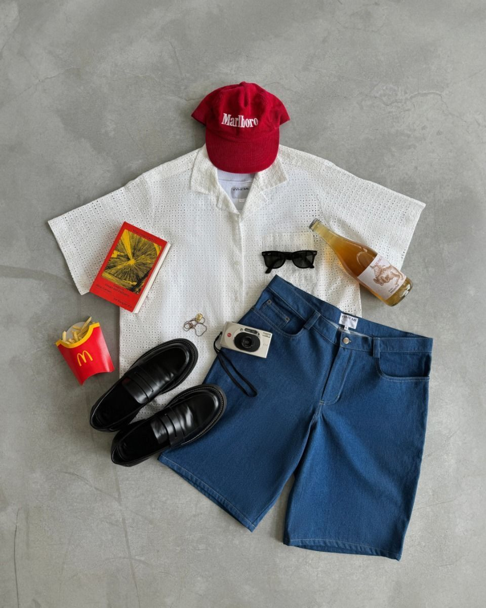
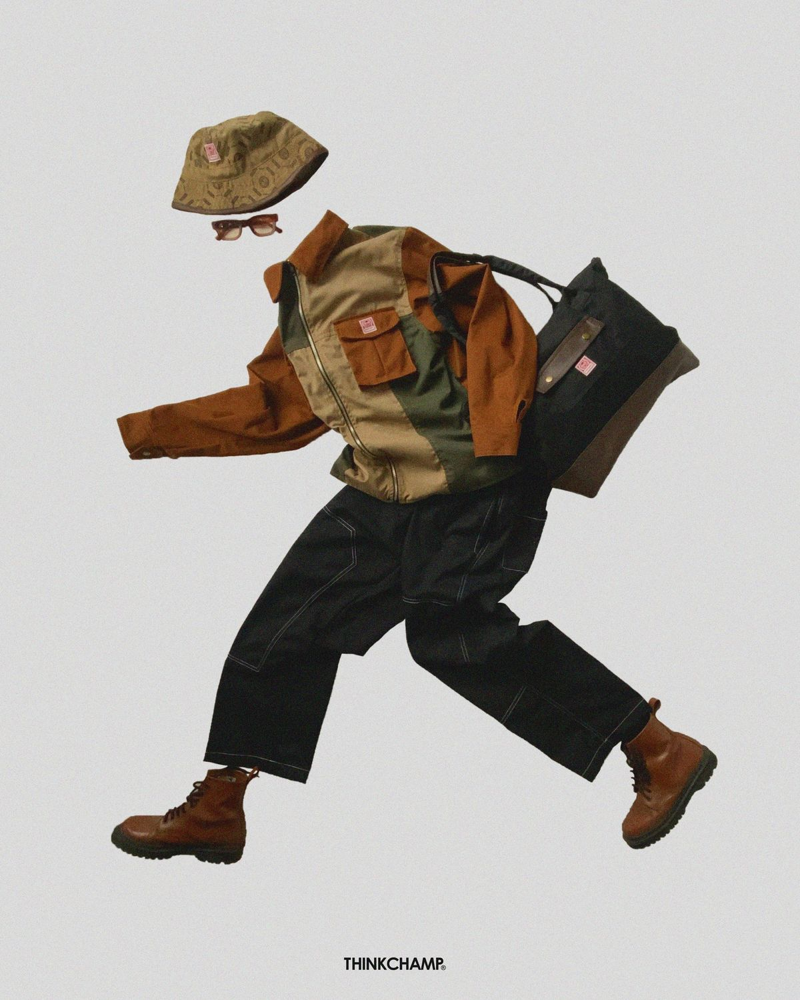
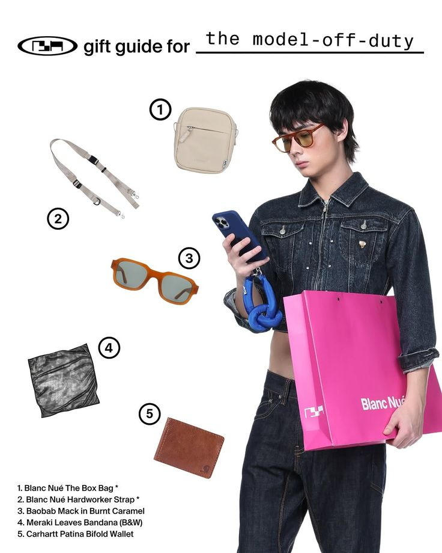
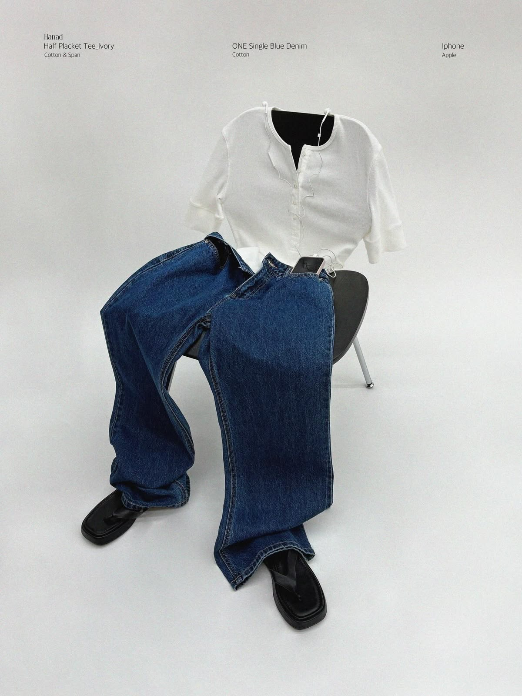
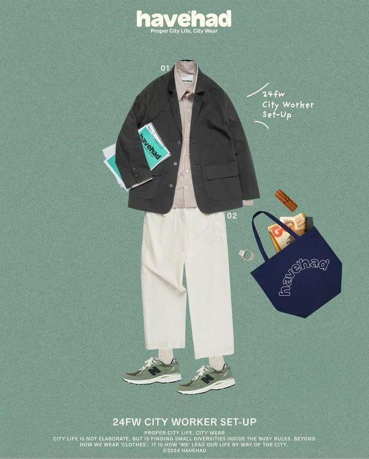

# Outfit Visual Studio

Outfit Visual Studio is a standalone AI visual workflow application for creating outfit visuals from explicit product references. It is built for menswear and genderless styling workflows, with a strong emphasis on preserving the uploaded garments.

The core workflow is:

```text
Outfit -> Scene -> Composition -> Look / Light -> Generate -> Result
```

## What It Does

- Upload local product reference images.
- Assign references to outfit slots such as Top, Outer, Bottom, Shoes, Bag, and Accessories.
- Choose Scene, Composition, Look, output format, and generation provider.
- Compile deterministic production prompts.
- Run Prompt QA before generation.
- Generate automatically with OpenAI image generation or prepare a ChatGPT Manual handoff package.
- Persist generation history, results, revisions, and retries locally.

## Product Fidelity

Product fidelity is a first-class rule:

- Uploaded product references are authoritative.
- The system should preserve product shape, color, material, graphics, construction, and proportions.
- Styling, scene, graphic layout, and mood must not redesign uploaded garments.
- Missing assets remain empty. The app does not invent missing products or silently substitute another item.

## V1 Skills

The Skill system is an orchestration layer above the existing workflow engine. It does not replace the Prompt Compiler, Prompt QA, provider adapters, generation persistence, or result history.

V1 includes six callable Skills:

- `SK01_MINIMAL_FLAT_LAY` - Minimal Flat Lay
- `SK02_INVISIBLE_EDITORIAL` - Relaxed Editorial Floor Lay
- `SK03_LOOK_BREAKDOWN` - Look Breakdown
- `SK04_PROP_STYLING` - Prop Styling
- `SK05_JAPANESE_CATALOG` - Japanese Catalog
- `SK06_KOREAN_STREET_EDITORIAL` - Korean Street Editorial

V1 supports `men` and `genderless` content types. Couple workflows are not supported by the V1 Skill layer.

## Public Skill Usage

Outfit Visual can be used in two ways:

1. Native Agent Mode
   Use the Skill directly with an Agent that already supports image generation/editing. No separate provider API key is required when your Agent already provides compatible image-generation capabilities.

2. Studio + MCP Mode
   Optional advanced local workflow with the open-source repository. Clone this project and connect the Outfit Visual MCP server to gain Skill Registry tools, validation, asset IDs, history, revision/retry, and provider automation.

MCP is not mandatory for using the public Skill. Not every Agent supports image generation; when an Agent has neither compatible native image-generation capabilities nor MCP execution, generation cannot be completed in that environment.

Native Agent Mode does not add automatic asset classification: use explicit Top, Outer, Bottom, Shoes, and other slot assignments from the user, and ask for clarification when Required garment roles are ambiguous.

The Skill translates simple requests such as `Use 01`, `Use 02`, `Use Relaxed Editorial Floor Lay`, `Use Japanese Catalog`, `Use 05 Japanese catalog`, or `Use 06 Korean street editorial` into the canonical visual contracts. The contract is stronger than the generic meaning of the Skill name.

## Visual Skill Gallery

Users can refer to a Skill by:

- number
- English name
- short visual description

Examples:

- "Use 02"
- "Use Relaxed Editorial Floor Lay"
- "Use 05 Japanese catalog"

### 01 - Minimal Flat Lay

Clean minimal flat-lay outfit image for complete outfit presentation.



### 02 - Relaxed Editorial Floor Lay

Relaxed natural editorial floor-lay outfit still life with no body-shaped outfit illusion.



### 03 - Look Breakdown

Complete look plus individual product breakdown.



### 04 - Prop Styling

Outfit styled with one hero chair or simple prop in a clean grey-white studio.



### 05 - Japanese Catalog

Japanese magazine/catalog-inspired outfit visual.


### 06 - Korean Street Editorial

Korean / Seoul street editorial outfit visual.



## Agent Tools

Outfit Visual Studio exposes four stable internal Agent Tools:

- `list_outfit_skills`
- `get_outfit_skill`
- `validate_outfit_skill`
- `execute_outfit_skill`

Expected agent flow:

1. List available Skills.
2. Inspect the selected Skill.
3. Collect explicit current-project asset IDs.
4. Validate the Skill input.
5. Execute only after validation allows it.

Agent calls still use explicit asset IDs. The system does not perform automatic image discovery, automatic slot assignment, or asset classification.

## MCP Support

A local MCP stdio adapter exposes the same four Agent Tools for optional Studio + MCP Mode.

For a fresh local MCP setup:

```bash
git clone https://github.com/rochyzhang/outfit-visual-skill.git
cd outfit-visual-skill
pnpm install
cp .env.example .env.local
pnpm run db:generate
pnpm run db:migrate
pnpm run mcp:skills
```

Configure provider credentials in `.env.local` or in the Studio Provider Settings UI. Do not commit `.env.local`.

Start only the MCP adapter:

```bash
pnpm run mcp:skills
```

Example local MCP client configuration:

```json
{
  "mcpServers": {
    "outfit-visual-studio-skills": {
      "command": "pnpm",
      "args": ["run", "mcp:skills"],
      "cwd": "/path/to/outfit-visual-studio"
    }
  }
}
```

The MCP layer is only a transport adapter. It delegates to the existing Agent Tool layer and production generation pipeline.

## Installation

Requirements:

- Node.js
- pnpm

Install dependencies:

```bash
pnpm install
```

Create local environment configuration:

```bash
cp .env.example .env.local
```

Run database setup:

```bash
pnpm run db:generate
pnpm run db:migrate
```

Start development:

```bash
pnpm run dev
```

Open the app at the local URL printed by Next.js, usually `http://localhost:3000`.

## Provider Configuration

Provider credentials are local runtime configuration and must not be committed.

Supported configuration paths:

- Environment variables such as `OPENAI_API_KEY`
- Local Provider Settings in the Studio UI

ChatGPT Manual mode does not store a credential and does not call ChatGPT programmatically. It creates a handoff package for the user to copy into ChatGPT manually.

## Tests

Common verification commands:

```bash
pnpm run lint
pnpm run typecheck
pnpm run build
pnpm run test:skill-api
pnpm run test:skill-execute
pnpm run test:agent-tool-registry
pnpm run test:agent-tool-execution
pnpm run test:mcp-tool-registry
pnpm run test:mcp-tool-execution
pnpm run release:check
```

## Local Runtime Data

The app writes local runtime files for development:

- SQLite databases under `data/`
- provider secrets under `data/secrets/`
- uploaded assets under `storage/assets/`
- generated images under `storage/generated/`

These paths are ignored by Git. Do not publish local runtime data, user uploads, generated images, provider credentials, or `.env.local`.

## Release Packaging

The Red Skill package is prepared under:

```text
release/red-skill/outfit-visual-skill/
```

The ZIP artifact is:

```text
release/red-skill/outfit-visual-skill.zip
```

Before publishing, run:

```bash
pnpm run release:check
```
