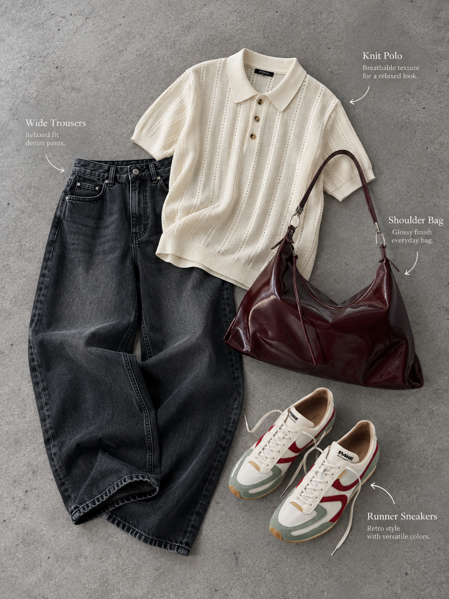
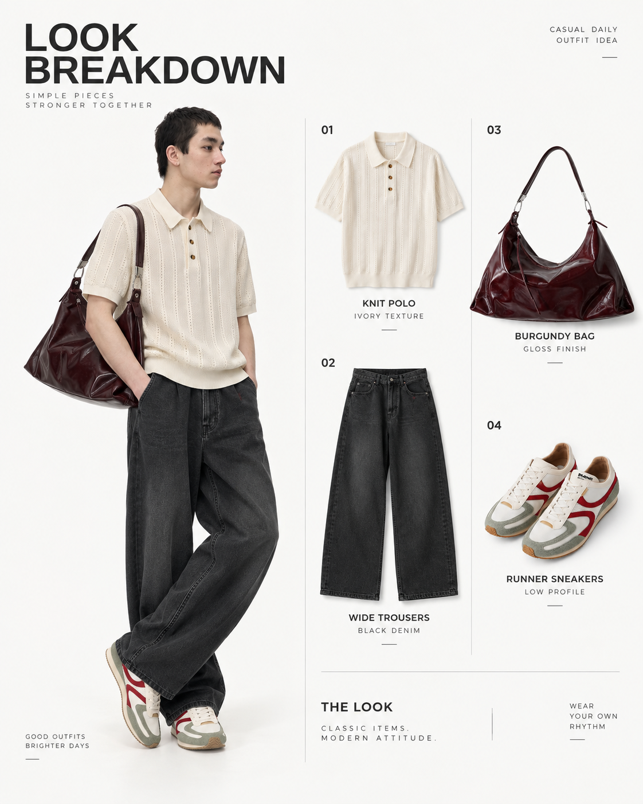
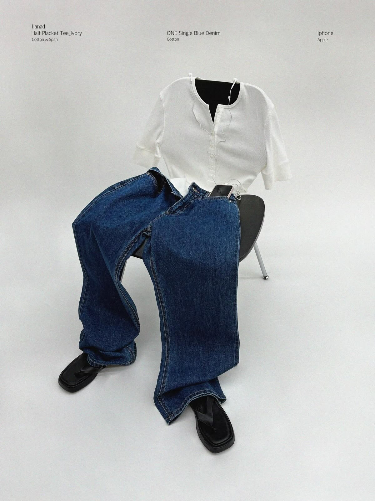
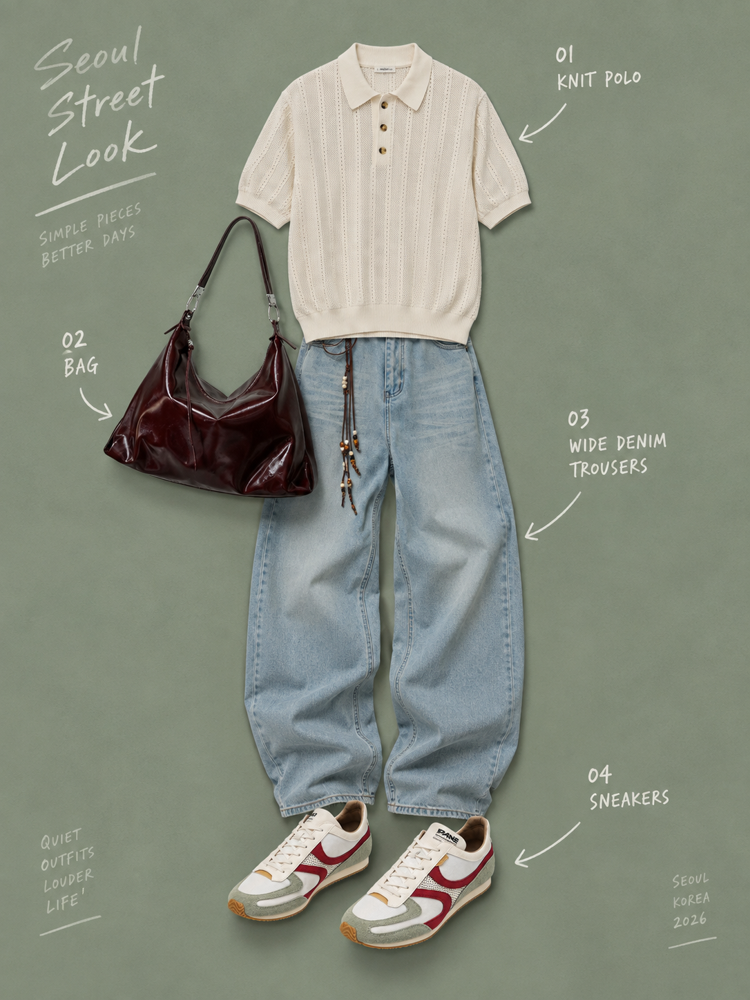

# Skill Gallery

These images are presentation-style references only. They are not product assets and must not be used for garment-role classification.

Users can refer to a Skill by number, English name, or short visual description.

Packaged gallery images are isolated per selected Skill. Use only the selected Skill's own image path as its visual reference; other packaged examples are for browsing and documentation only.

Examples:

- "Use 02"
- "Use Clean Editorial Flat Lay"
- "Use 05 Japanese catalog"

## 01 - Minimal Flat Lay

- Skill ID: `SK01_MINIMAL_FLAT_LAY`
- English name: Minimal Flat Lay
- Chinese description: 干净平铺穿搭图，适合整套搭配展示
- Canonical visual behavior: Realistic minimal true overhead or near top-down flat lay on a slightly cooler, cleaner neutral-grey indoor cement/concrete floor. The uploaded outfit is casually layered with soft low-saturation daylight, soft-edged grounded shadows, faithful product color, real still-life photography feel, and richer lightweight Title Case English arrow/leader-line product annotations with short optional descriptors placed in negative space.
- Required inputs: `bottom`, `shoes`, and at least one of `top` or `outer`.
- Forbidden elements: human model, portrait photography, lifestyle street photography, pure white cutout collage, warm beige/yellow floor cast, brownish or muddy grey cast, overly contrasty floor texture, hard spotlight, floating graphic composition, sterile ecommerce grid, poster title, dense information layout, all-caps-only product naming, SK02-style systematic label grid, invented products, substituted products, missing required products.
- Usage example: "Use 01"

## 02 - Clean Editorial Flat Lay

- Skill ID: `SK02_INVISIBLE_EDITORIAL`
- English name: Clean Editorial Flat Lay
- Chinese description: 干净棚拍平铺穿搭图，单品关系清晰、留白克制。
- Canonical visual behavior: Clean human-absent editorial flat lay on a pale neutral studio surface. Uploaded products are intentionally arranged in a cleaner, tidier, more controlled studio composition than SK01, with clear product separation, deliberate spacing, neat alignment, simple hierarchy, subtle contact shadows, polished negative space, minimal deliberate overlap, a restrained English top title, and systematic product information labels with thin leader lines. It is not an invisible-body, mannequin, prop styling, SK03 product breakdown, SK05 catalog graphic, Korean callout, or SK01-like casual concrete-floor presentation.
- Required inputs: `bottom`, `shoes`, and at least one of `top` or `outer`.
- Forbidden elements: visible face, visible skin, identifiable human model, mannequin, invisible-body structure, body-shaped outfit arrangement, human silhouette, invented products, missing required products, copied brand names, URLs, logos, months, slogans, non-English text, furniture, decorative props, room architecture, lifestyle clutter, cement-floor realism, strong concrete texture, warm beige cast, casual layered still-life feeling, natural relaxed scattering, thrown-down styling, excessive overlap, catalog graphics, Korean callouts, rigid ecommerce grid, hard spotlight.
- Usage example: "Use Clean Editorial Flat Lay"

## 03 - Look Breakdown

- Skill ID: `SK03_LOOK_BREAKDOWN`
- English name: Look Breakdown
- Chinese description: 整套 Look + 单品拆解说明
- Canonical visual behavior: Editorial layout with one primary styled Look plus separate product/component breakdown, clean English sans-serif labels, and automatic reflow when optional items such as hats or bags are present. It should not add free-floating handwritten words, slogans, books, thumbnails, zoom frames, or detail boxes.
- Required inputs: at least 3 valid user-provided product/outfit references.
- Forbidden elements: copied products from the reference image, invented products, non-English labels, cluttered poster layout, wrong output type, crowded optional accessories, extra free-floating text, handwritten slogans, books, thumbnails, detail boxes, SK05 catalog typography, SK06 hand-drawn callouts.
- Usage example: "Use 03"

## 04 - Prop Styling

- Skill ID: `SK04_PROP_STYLING`
- English name: Prop Styling
- Chinese description: 衣服与椅子、家具或小物一起陈列
- Canonical visual behavior: Product-first still life with clothing styled around one hero chair or simple hero prop in a clean premium cool grey-white studio wall/floor environment with a simple neutral backdrop, soft even ambient studio light, no visible sunbeam/window-light streak, no extra furniture clutter, one small text-only English top information row, and a chair-supported outfit display. Interpret the chair as product display support, not a hidden seated body. Human-referential reading is allowed only through garment order and outfit relationship, not body shape. Tops stay empty, outerwear may drape or layer naturally, trousers drape from fabric gravity and chair contact without thigh/knee/calf anatomy, bags remain independent product styling, and shoes remain product placement rather than invisible feet.
- Required inputs: `bottom` and at least one of `top` or `outer`.
- Forbidden elements: prop as main subject, rough cement room, industrial concrete-wall dominance, cement-wall or concrete-room atmosphere, visible sunbeam, window-light streak, diagonal light patch, dramatic floor shadow, warm sunlight, shelf/cabinet/table clutter, multiple competing furniture pieces, decorative architecture, warm yellow/orange room tone, overly cozy grading, hard spotlight, invented fashion products, copied reference-image products, impossible fabric contact, missing required products, real human, face, skin, full mannequin, hidden mannequin, chair acting like hidden torso/pelvis/thighs/legs, invisible seated person, invisible body volume inside garments, inflated trousers, thigh/knee/calf anatomy, shoes posed like invisible feet, SK06 standing-pose semantics, strong 3D invisible-person body, large poster headline, flat-lay mini images, thumbnails, detail boxes, books.
- Usage example: "Use Prop Styling"

## 05 - Japanese Catalog

- Skill ID: `SK05_JAPANESE_CATALOG`
- English name: Japanese Catalog
- Chinese description: 日杂 / 日系目录感穿搭视觉
- Canonical visual behavior: Warm off-white Japanese magazine/catalog page with the main outfit dominant, integrated product descriptions, elegant magazine typography, English as the primary product-information language, and limited short Japanese editorial accent text. It should not use hand-drawn callouts, books, slogans, thumbnails, detail boxes, or technical product-detail boards.
- Required inputs: `bottom`, `shoes`, and at least one of `top` or `outer`.
- Forbidden elements: large blocks of Japanese text, unreadable Japanese-like noise, generic model portrait, arbitrary Japanese typography, hand-drawn typography, white sketch arrows, SK06 handwritten callouts, extra slogans, book props, product zoom/detail-box columns, cropped close-up thumbnail panels, technical spec-sheet layout, invented products, copied reference-image products, missing required products.
- Usage example: "Use 05 Japanese catalog"

## 06 - Korean Street Editorial

- Skill ID: `SK06_KOREAN_STREET_EDITORIAL`
- English name: Korean Street Editorial
- Chinese description: 韩系 / 首尔街头编辑感穿搭图
- Canonical visual behavior: Dusty-sage flat staged Korean editorial with mandatory white hand-drawn English per-product callouts. The garments form one complete laid-out Look through normal wearing-order placement only: top/hat at upper-body or head position, trousers directly below, shoes at the bottom with both shoe toes pointing left, bag near the upper-body/shoulder side, and any hat brim/front facing the same leftward direction. It includes subtle asymmetry and coordinated product direction while remaining flat, empty, unworn, non-inflated, graphic, and not worn by an invisible person.
- Required inputs: `bottom`, `shoes`, and at least one of `top` or `outer`.
- Forbidden elements: visible person, mannequin, Korean text, Hangul, standing invisible-person styling, hidden standing body, worn-body presentation, inflated garment volume, pelvis/hip/thigh/knee/calf anatomy, shoes posed like invisible feet, shoes pointing right or mixed directions, hat brim/front pointing away from shoe direction, random opposing shoe directions, shoes detached from the wearing-order relationship, random flat-lay scattering, accessory placement with no wearing-order logic, rigid straight-line flat lay with no pose, independent product breakdown, generic catalog grid, SK05 Japanese magazine typography, detail boxes, thumbnails, book props, invented products, copied reference-image products, missing required products.
- Usage example: "Use 06 Korean street editorial"

