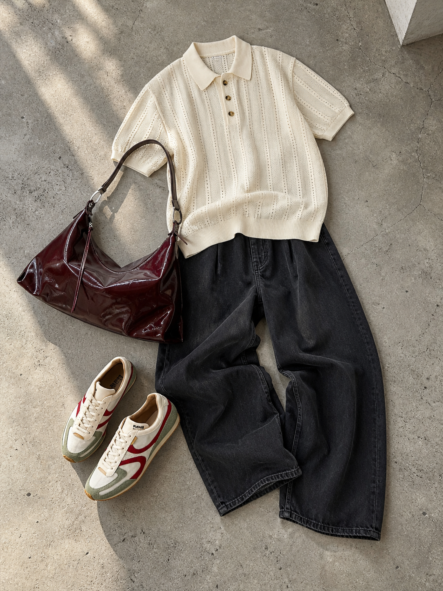

# Skill Gallery

These images are presentation-style references only. They are not product assets and must not be used for garment-role classification.

Users can refer to a Skill by number, English name, or short visual description.

Packaged gallery images are isolated per selected Skill. Use only the selected Skill's own image path as its visual reference; other packaged examples are for browsing and documentation only.

Examples:

- "Use 02"
- "Use Clean Editorial Flat Lay"
- "Use 05 Japanese catalog"

## 01 - Minimal Flat Lay

- Skill ID: `SK01_MINIMAL_FLAT_LAY`
- English name: Minimal Flat Lay
- Chinese description: 干净平铺穿搭图，适合整套搭配展示
- Canonical visual behavior: Realistic minimal true overhead or near top-down flat lay on a slightly cooler, cleaner neutral-grey indoor cement/concrete floor. The uploaded outfit is casually layered with soft low-saturation daylight, soft-edged grounded shadows, faithful product color, real still-life photography feel, and lightweight English arrow/leader-line product annotations placed in negative space.
- Required inputs: `bottom`, `shoes`, and at least one of `top` or `outer`.
- Forbidden elements: human model, portrait photography, lifestyle street photography, pure white cutout collage, warm beige/yellow floor cast, brownish or muddy grey cast, overly contrasty floor texture, hard spotlight, floating graphic composition, sterile ecommerce grid, poster title, dense information layout, SK02-style systematic label grid, invented products, substituted products, missing required products.
- Usage example: "Use 01"

## 02 - Clean Editorial Flat Lay

- Skill ID: `SK02_INVISIBLE_EDITORIAL`
- English name: Clean Editorial Flat Lay
- Chinese description: 干净棚拍平铺穿搭图，单品关系清晰、留白克制。
- Canonical visual behavior: Clean human-absent editorial flat lay on a pale neutral studio surface. Uploaded products are intentionally arranged in a cleaner, tidier, more controlled studio composition than SK01, with clear product separation, deliberate spacing, neat alignment, simple hierarchy, subtle contact shadows, polished negative space, minimal deliberate overlap, a restrained English top title, and systematic product information labels with thin leader lines. It is not an invisible-body, mannequin, prop styling, SK03 product breakdown, SK05 catalog graphic, Korean callout, or SK01-like casual concrete-floor presentation.
- Required inputs: `bottom`, `shoes`, and at least one of `top` or `outer`.
- Forbidden elements: visible face, visible skin, identifiable human model, mannequin, invisible-body structure, body-shaped outfit arrangement, human silhouette, invented products, missing required products, copied brand names, URLs, logos, months, slogans, non-English text, furniture, decorative props, room architecture, lifestyle clutter, cement-floor realism, strong concrete texture, warm beige cast, casual layered still-life feeling, natural relaxed scattering, thrown-down styling, excessive overlap, catalog graphics, Korean callouts, rigid ecommerce grid, hard spotlight.
- Usage example: "Use Clean Editorial Flat Lay"

## 03 - Look Breakdown

- Skill ID: `SK03_LOOK_BREAKDOWN`
- English name: Look Breakdown
- Chinese description: 整套 Look + 单品拆解说明
- Canonical visual behavior: Main look plus numbered fashion item breakdown anchored only to the approved SK03 reference. The main look may be model-based but should avoid a clear face or recognizable facial features, using crop-below-chin, head-out-of-frame, or back/side-back framing while keeping short English item titles and a clean look-guide / gift-guide hierarchy.
- Required inputs: at least 3 valid user-provided product/outfit references.
- Forbidden elements: copied products from the reference image, invented products, visible recognizable face, portrait-focused model, non-English labels, long catalog paragraphs, poster-style branding layout, SK05 catalog page, SK06 Korean poster, wrong output type.
- Usage example: "Use 03"

## 04 - Prop Styling

- Skill ID: `SK04_PROP_STYLING`
- English name: Prop Styling
- Chinese description: 衣服与椅子、家具或小物一起陈列
- Canonical visual behavior: Product-first still life with clothing styled around one hero chair or simple hero prop in a clean, lighter grey-white studio wall/floor environment with a simple neutral backdrop, no extra furniture clutter, one small English top information row, and a chair-supported garment arrangement that suggests a wearable human outline without showing a person.
- Required inputs: `bottom` and at least one of `top` or `outer`.
- Forbidden elements: prop as main subject, cement-wall or concrete-room atmosphere, shelf/cabinet/table clutter, multiple competing furniture pieces, decorative architecture, warm yellow/orange room tone, overly cozy grading, hard spotlight, invented fashion products, copied reference-image products, impossible fabric contact, missing required products, real human, face, skin, full mannequin, strong 3D invisible-person body, large poster headline.
- Usage example: "Use Prop Styling"

## 05 - Japanese Catalog

- Skill ID: `SK05_JAPANESE_CATALOG`
- English name: Japanese Catalog
- Chinese description: 日杂 / 日系目录感穿搭视觉
- Canonical visual behavior: Quiet Japanese lifestyle catalog feeling anchored only to the approved SK05 reference, with warm off-white paper-like calm, soft editorial layout, gentle whitespace, product-led catalog composition, simple labels, short supporting copy, and English-only typography. This is not Japanese text generation, a SK03 breakdown board, or a SK06 poster.
- Required inputs: `bottom`, `shoes`, and at least one of `top` or `outer`.
- Forbidden elements: Japanese text, fake Japanese glyphs, kana, kanji, Hangul, Korean text, poster-style branding, SK03 as style anchor, SK03 numbered breakdown board, generic heavy model portrait, invented products, copied reference-image products, missing required products.
- Usage example: "Use 05 Japanese catalog"

## 06 - Korean Street Editorial

- Skill ID: `SK06_KOREAN_STREET_EDITORIAL`
- English name: Korean Street Editorial
- Chinese description: 韩系 / 首尔街头编辑感穿搭图
- Canonical visual behavior: Korean independent-brand poster anchored only to the approved SK06 reference, with a dusty-sage flat 2D human-silhouette outfit, generic fictional title, setup/look title, white hand-drawn product callouts, and a very short poster tagline. The garments form one complete clothing-only head-to-toe Look without real human, face, skin, street-photo model, mannequin, or strong 3D invisible body.
- Required inputs: `bottom`, `shoes`, and at least one of `top` or `outer`.
- Forbidden elements: visible person, face, skin, street-photo model, mannequin, strong 3D invisible body, Korean text, Hangul, Japanese text, SK03 as style anchor, SK03 item breakdown board, SK05 catalog page, generic catalog grid, invented products, copied reference-image products, missing required products.
- Usage example: "Use 06 Korean street editorial"

